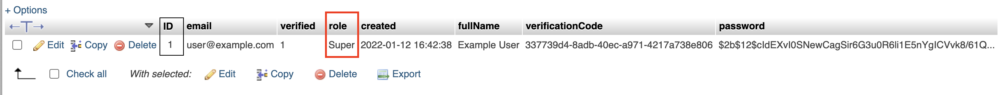

# Running The App

There are a few different ways to run the app and each way has its tradeoffs.

## General Requirements:

You'll need to have the following installed:

- [yarn](https://classic.yarnpkg.com/lang/en/docs/install/#mac-stable)
- [NodeJS](https://nodejs.org/en/) version >= `16.0.0`.

If you haven't already, you'll need to clone the [API repository](https://github.com/CHDR-Inventory-System/server) to run the backend locally on your own computer. Make sure to follow the instructions there to get that running.

In the root directory of this project, create a file named `.env` with the following values:

```properties
# This should match the URL of the server started by the API. If you change the port
# the server runs on, you'll need to update DEBUG_API_URL
DEBUG_API_URL=http://127.0.0.1:4565/api
PROD_API_URL=https://chdr.cs.ucf.edu/inventory/api
```

`.env` doesn't really contain any secret hidden values, it's just easier to update the API url's if it's in one easy to find file.

## Before You Start

You'll need to have the server running locally on your own computer before you run the mobile app. **NOTE**: When running the server, make sure you pass the `debug` argument to run the server in debug, so `python src/app.py --debug`.

Run `yarn` in the root directory of the project to install necessary dependencies.
In the root directory, create a file named `.env` with the following values:

# iOS

Requirements:

- macOS
- Any iPhone or iPad running iOS >= 12.0
- Xcode >= 13.3 (older versions of Xcode will _probably_ work, but I'd stick with this version to produce reliable results)

Before you run the app, you'll need to go into Xcode to change the signing team. In the `ios` directory, open `chdrinventory.xcworkspace`. Once Xcode opens, go to the `Signing & Capabilities` tab to change the team.


## Running on an iOS simulator using CLI (Recommended)

The benefit of this method is that any changes to the source will cause the app to be automatically reloaded and it can all be done through the command line.

1. In the root directory of this project run `cd ios && pod install` to install necessary iOS dependencies.
2. Run `yarn ios:debug` to start the app. This should open the app in a simulator.

**Side note**: In order to log in and test anything, you'll need to have an existing admin account. If you're running the server locally, you can use the website to create an account ([you'll need to clone the client repo from here](https://github.com/CHDR-Inventory-System/client)). After you're created you account, go into phpMyAdmin (which you can access from http://localhost:8080/) and change your role to either `Admin` or `Super`.



**Side note 2:** `yarn ios:debug` will run the app using the `Debug` configuration. This means that any requests will use `DEBUG_API_URL` from the `.env` file. You can run `yarn io:prod` to force requests to use `PROD_API_URL` instead.

## Running on an iOS simulator using Xcode

This method uses Xcode to run the app on an iOS simulator instead of using the `react-native` cli.

In the `ios` folder, open `chdrinventory.xcworkspace` in Xcode. At the top, select a simulator you want to use to run the app. Before you run the app however, in the menu, click `Product > Scheme > Edit Scheme`, and make sure `Build Configuration` is set to `Debug`.


After that's set, you should be able to click run to launch the app in a simulator

## Running on a physical iOS device using CLI

Running the app on a physical iOS device using the command line requires [ios-deploy](https://www.npmjs.com/package/ios-deploy) to be installed. You can install it via homebrew with

```
brew install ios-deploy
```

Once that's installed, you'll need the name of your device. To find it, open the settings app and go to `General > About > Name`. After you have that info, you can plug in your phone to your computer and run `yarn ios:debug --device "<device name here>"`. So as an example:

```
yarn ios:debug --device "Cam's iPhone"
```

## Running on a physical iOS device using Xcode

This step is pretty similar to running on an iOS simulator using Xcode and doesn't require `ios-deploy` to be installed. Instead of selecting a simulator, plug your phone into your computer and select it from the list of available devices.

## Troubleshooting iOS

- **The Problem**: When running the app using the `Debug` configuration, API requests may fail with the message `Network Error`

  - **The Solution**: This is because your device can't access the server that's running locally on your computer. To fix this, you can either run the app in production mode (not recommended) or you can change `DEBUG_API_URL` to an IP address that visible across your network ([see this SO thread](https://stackoverflow.com/questions/7023052/configure-flask-dev-server-to-be-visible-across-the-network)).

- **The Problem**: `Failed to build iOS project. We ran "xcodebuild" command but it exited with error code 65`

  - **The Solution**: This usually means you forgot to run `pod install`. If you've already done so and are still getting this error, try removing the `node_modules` and `ios/Pods` folder then run `yarn`, and `cd ios && pod install`

- **The Problem**: When running the app on a simulator, a terminal pops up that runs metro. Sometimes, pressing `r` or `d` in that terminal doesn't actually reload the simulator or open the debug menu.

  - **The solution**: In simulator menu, press `Device > Shake` to open the developer menu.

- **The Problem**: When running the app on a simulator, making changes to the code will cause the app to automatically reload to reflect those changes. However, when running the app on a physical devices, those changes won't be reflected because metro can't connect to the device.

  - **The Solution**: [This is a known issue with metro](https://github.com/facebook/react-native/issues/29396). [This SO thread might be useful too](https://stackoverflow.com/questions/62937553/no-apps-connected-sending-reload-to-all-react-native-apps-failed-make-sure-y).

**IMPORTANT**: When you run the app on your phone, the app will stay on your phone. **BUT**, if you don't have a paid developer account ($99/yr), then the app will no longer open after the 7th day. The only way around this is to either pay for a developer account or re-run the app with Xcode.

# Android

Requirements:

- [Android Studio](https://developer.android.com/studio)
- [adb](https://developer.android.com/studio/command-line/adb) (_should_ come with Android Studio but make sure you can run `adb` from the command line)

## Running on a simulator using CLI (Recommended)

Before you can run the app on a simulator, you need to create a simulator using Android Studio. To do so, Open Android Studio and click `Configure` on the bottom right then click `AVD Manager`. From there, you should see a screen that looks like the image below. This is where you can create a new virtual device.


Once you've created a new virtual device, run:

```
yarn android:debug
```

to start the app. It should automatically

## Running on a physical device using CLI

This one's pretty straightforward. Make sure your phone is plugged into your computer and run the same command used in the step directly above this one. The app should automatically be loaded onto your phone (assuming you don't have any simulators open). If it doesn't launch on your phone, check out the [troubleshooting](#troubleshooting-android) section below.

## Running on a virtual or physical device using Android Studio

Open the `android` directory in Android Studio. After you wait for the project to sync, select the device you want to run the app on using the menu to the left of the run button then click run.

## Troubleshooting Android

- **The problem**: running `yarn android:debug` or `yarn android:production` doesn't automatically launch the device on my phone.
  - **Solution**: Start the emulator manually (refer to the virtual devices screenshot posted above) then run `adb devices` in your terminal. You should see output that looks something like:
    ```
    List of devices    attached
    0715f730a9de343a   device
    ```
    Running `yarn android:debug --deviceId 0715f730a9de343a` should launch the app on that device (you'll have to replace that device ID with your output of course).
- **The problem**: Running `yarn android:debug` or `yarn android:prod` might give this error: `Cannot find AVD system path. Please define ANDROID_SDK_ROOT`

  - **Solution**: Make sure `ANDROID_HOME` is added to your path. This should've been done automatically when installing Android Studio, but if not, [check out this SO thread for macOS](https://stackoverflow.com/questions/40248265/how-to-set-android-sdk-root-in-mac) and [this SO thread for windows](https://stackoverflow.com/a/44386974/9124220).

- **The Problem**: When running the app through Android Studio, you may see this error: `Cannot run program "node": error=2, No such file or directory`

  - **The Solution**: This one is kind of rare and mostly happens on macOS. Try running `open -a /Applications/Android\ Studio.app`, re-sync gradle, then try to run the app again. 

- **The Problem**: When using a simulator, API requests fail with `Network Error`. You can't access the server running locally on your computer 🤬

  - **The Solution**: This is probably because the port the server is running on hasn't been forwarded by ADB yet. Run:

    ```
    adb reverse tcp:4565 tcp:4565
    ```

    to map the local port `4565` to the mobile's `4565` port. If you changed the port the server is running on, you'll need to substitute that here.

- **The Problem**: Running the app through Android Studio successfully launces the app on the phone but you're immediately greeted with a terrifying red screen that says something along the lines of: `Unable to load script from assets. Make sure your bundle is packaged correctly or you're running a packager server.`
  - **The Solution**: This usually happens because running the android app directly through Android Studio may not automatically start the metro server needed by react native. To fix this, first take note of the port mentioned in the error logs (this is usually `8081` by default). Make sure the app is stopped and run
    ```
    yarn react-native start --port 8081
    ```
    in the root directory of the project to start the metro server. If you re-run the android app, it should load properly now. If that still doesn't fix the issue, [try checking out this SO thread](https://stackoverflow.com/questions/44446523/unable-to-load-script-from-assets-index-android-bundle-on-windows).
